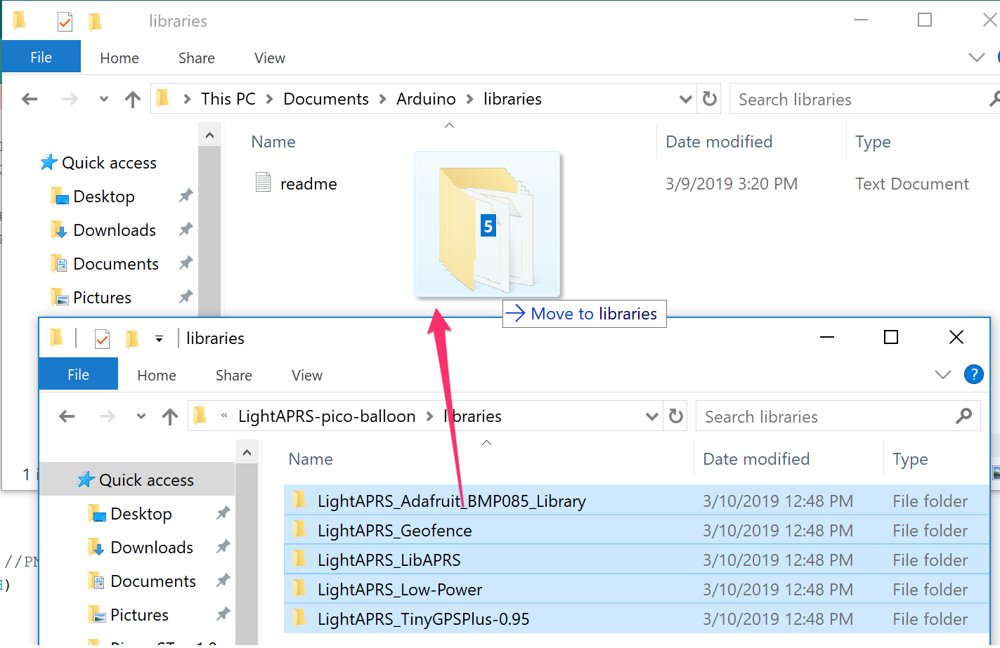

# LightAPRS Tracker

LightAPRS is one of the most affordable, smallest, lightest, powerful and open source APRS trackers available. It makes tracking pico balloons, weather balloons, model rockets, RC aircraft, and anything else that flies simple and easy.
It is able to report location, altitude, temperature and pressure to the internet ([APRS-IS](http://status.aprs2.net)) or direct to an amateur radio once a minute with a solar panel/supercapacitors or just 4xAAA batteries.
Because LightAPRS is open source you can add your own custom sensors via I2C/SPI pins.

LightAPRS is available on http://shop.qrp-labs.com/aprs/lightaprs for order. If you need an APRS+WSPR tracker than checkout:

**LightAPRS-W 1.0:** https://github.com/lightaprs/LightAPRS-W-1.0

**LightAPRS-W 2.0:** https://github.com/lightaprs/LightAPRS-W-2.0 (New)

**LoRa/LoRaWAN Tracker:** https://github.com/lightaprs/LightTracker-1.0

**Important :** LightAPRS uses the amateur 2 meter radio band which requires an [amateur radio license](http://www.arrl.org/getting-licensed) to operate.
 
## Basic Features
 
- **Software** : Open Source
- **Weight** : 8 grams
- **Dimensions**    : 3 cm x 5 cm
- **IDE** : Arduino
- **Platform** : MightyCore
- **CPU** : Atmega1284P-AU
- **Flash** : 128 kB
- **Ram** : 16 kB
- **EEPROM** : 4 kB
- **Operating Frequency** : 8 Mhz
- **Operating Voltage** : 3.3 Volt
- **Input Voltage** : 4.5 (min) - 10 (max) Volt via usb or VBat pin
- **BOD** : 2.7 Volt
- **Sensor** : BMP180 (pressure and temperature)
- **Radio Module** : [Dorji DRA818V](http://www.dorji.com/products-detail.php?ProId=55) (included)
- **Radio Operating Frequency** : 144-146 Mhz (configurable by code)
- **Low Pass Filter** : Available (7 elements)
- **Radio Power**  : 0.5 Watt or 1 Watt (configurable by code)
- **Power Consumption (Sleep)** : ~5 mA
- **Power Consumption (TX)** : ~460 mA (0.5 Watt) / ~760 mA (1 Watt) (Automatically selected based on input voltage by code)
- **GPS** : Ublox MAX-M8Q (GPS-GLONASS)
- **GPS Antenna Gain** : 4.3 dBi
- **Extended Pins** : I2C, SPI
- **USB Serial** : CH340G

## Configuration

To programme LightAPRS Tracker, all you need is a micro usb (B type) cable, a few installations and configurations.

### 1.Install CH340G Driver

The CH340 chip is used by a number of Arduino compatible boards (and by LightAPRS) to provide USB connectivity, you may need to install a driver. (If you have installed it before for a clone Arduino board, you don't have to install it again.)

Don't worry, it's really easy. Just download the following driver from sparkfun.com and install it.

- [Windows](https://cdn.sparkfun.com/assets/learn_tutorials/8/4/4/CH341SER.EXE)
- [Mac](https://cdn.sparkfun.com/assets/learn_tutorials/8/4/4/CH341SER_MAC.ZIP), if on an ARM based mac then use [this](https://www.wch-ic.com/downloads/CH341SER_MAC_ZIP.html).
- [Linux](https://cdn.sparkfun.com/assets/learn_tutorials/8/4/4/CH341SER_LINUX.ZIP)

### 2.Install Arduino IDE

Download and install [Arduino IDE](https://www.arduino.cc/en/Main/Software). If you have already installed Arduino, please check for updates. Its version should be v1.8.7 or newer (The newer 2.x.x versions also work, no need to use the legacy 1.x.x versions).

### 3.Install MightyCore

- Open the Arduino IDE.
- Open the **File > Preferences** menu item. [[Screenshot]](images/arduino-preferences-boards-manager-url.png)
- Enter the following URL in Additional Boards Manager URLs:
> https://mcudude.github.io/MightyCore/package_MCUdude_MightyCore_index.json
- Separate the URLs using a comma ( , ) if you have more than one URL
- Open the **Tools > Board > Boards Manager...** menu item. [[Screenshot]](images/arduino-tools-boards-manager.png)
- Wait for the platform indexes to finish downloading.
- Type "MightyCore" in the search bar until you see the **MightyCore** entry and click on it. 
- Click **Install** .
- After installation is complete, close the **Boards Manager** window.

### 4.Configure MightyCore

- Open the **Tools > Board** menu item and select **ATMega1284** from the end of the list. [[Screenshot]](images/arduino-boards-manager-mightycore-select.png)
- After selecting **ATMega1284** you will see new options under **Tools** menu. Select these options as follows:
- Clock: 8 MHz external
- BOD: 2.7v
- Pinout: Standard
- Variant: 1284P
- Compiler LTO : Disabled

### 5.Copy Libraries & Compile Source Code

You are almost ready to programme LightAPRS Tracker :)

- First download the repository to your computer using the green "[clone or download](https://github.com/VIP-LES/EosLightAPRS/archive/master.zip)" button.
- You will notice some folders in the "libraries" folder. You have to copy these folders (libraries) into your Arduino libraries folder on your computer. Path to your Arduino libraries:
- **Windows** : This PC\Documents\Arduino\libraries\
- **Mac** : /Users/\<username\>/Documents/Arduino/libraries/   

### 6.Config

- Open your local copy of the project
- Make a copy of the "example-aprs-config.h" file and name it "aprs-config.h"
- Open the file and adjust the necessary settings
- **Don't forget to update your callsign**

### 7.Upload

- First attach an antenna (at least 50cm monopole wire) to your tracker. Radio module may be damaged if operated without attaching an antenna, since power has nowhere to go.
- Connect LightAPRS Tracker to your computer with a micro USB cable.
- If you have successfully installed the CH340G driver explained in the first step, you should see a COM port under **Tools->Port** menu item. Select that port (if you don't see a port but have the driver installed, make sure the APRS is connected with a cable that supports both data & power, not just power).

  

- Click **Upload**
- Your tracker is ready to launch :)

